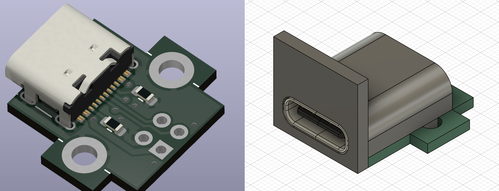
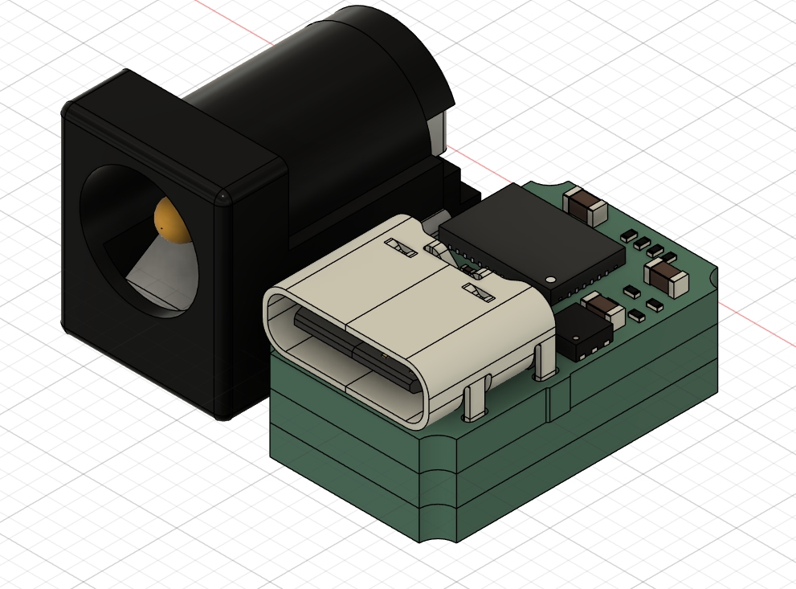
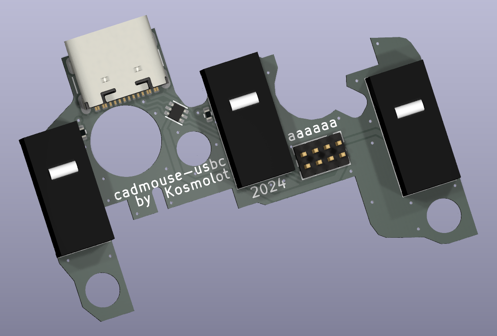
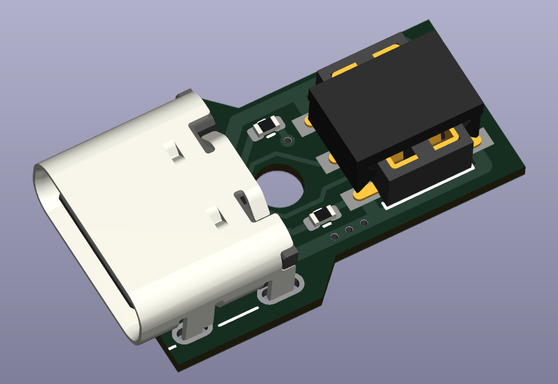

# I Put USB-C Everywhere

## (and you can't stop me)

This is my random collection of adapters and PCBs designed to make everything
in my lab USB-C compatible.

## USB type B replacement

Drop-in replacement for the old classic USB type B connector. Includes
a 3d-printed plastic part to match the connector shape.

## Barrel Jack replacement

Drop-in replacement for the good old 5.5mm, barrel jack.

- Mostly fits in the existing footprints.
- Set to 12V/3A by default.
- Puts the USB-C connector at the correct height by stacking three PCBs together.
- Allows for both positive and negative polarity, depending on the bottom PCB used.
- Voltage and current negotiation parameters can be changed by modifying resistor straps.

## 3dconnexion CadMouse

Replacement PCB for the 3Dconnexion CadMouse. Originally Micro USB.
Requires some milling to fit the new PCB.

## 3dconnexion SpaceMouse

Replacement PCB for the 3Dconnexion SpaceMouse. Originally Micro USB.
Includes a 3D-printed plastic part.

## FAQ

- Q: What's the USB connector on these designs?  
  A: My current goto connector is [GCT USB4105-GF-A](https://octopart.com/search?q=USB4105-GF-A).
  It's cheap and good. The WE equivalent is [629722000214](https://www.we-online.com/en/components/products/WR-COM_USB_20_TYPE_C_RECEPTACLE_HORIZONTAL_SMT#629722000214).
  Other manufacturers most probably have equivalent connectors - this is
  the de-facto standard footprint for USB-C 2.0.

- Q: Why?  
  A:

    
